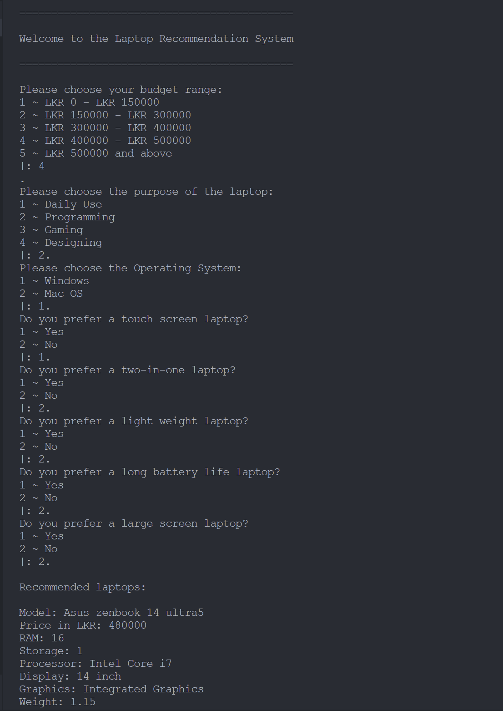

# Laptop Recommendation System

This Prolog-based system is designed to help users find the perfect laptop based on their budget and specific usage needs such as daily use, programming, gaming, or designing. It features a comprehensive database of laptops, including details like price, RAM, storage, processor type, screen size, graphics card, and weight.

## Features

- **Comprehensive Laptop Database**: Detailed information on a wide range of laptops from various manufacturers.
- **Custom Recommendations**: Users can receive laptop recommendations based on their budget and intended use.
- **User-Friendly Interface**: Easy-to-use prompts guide the user through the selection process for a seamless experience.

## Prerequisites

Before you can run this system, you need to have SWI-Prolog installed on your computer. You can download it from the [SWI-Prolog website](https://www.swi-prolog.org/Download.html).

## Screenshot of the System

